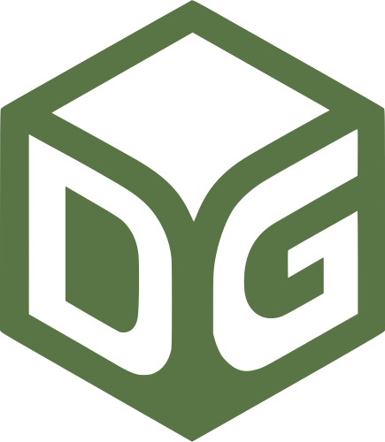
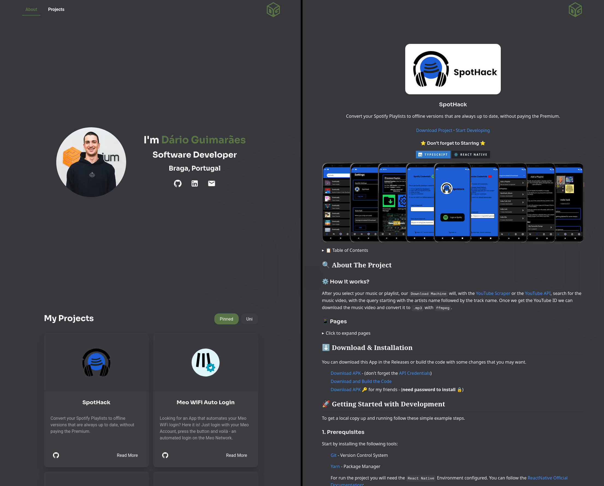

<!-- PROJECT LOGO -->
<br />
<div align="center">
  <a href="https://github.com/darguima/darguima.com">
    
  </a>

  <h3 align="center">darguima.com</h3>

  <p align="center">
    My Portfolio Website 👨‍💻 
    <br />
    <br />
    <a href="#-demo">View Demo</a>
    &middot;
    <a href="#-getting-started-with-development">Start Developing</a>
  </p>

<h4 align="center">
⭐ Don't forget to Starring ⭐
</h4>

  <div align="center">

[![TypeScript][TypeScript-badge]][TypeScript-url]
[![Next.js][Next.js-badge]][Next-url]
  </div>
</div>


<!-- TABLE OF CONTENTS -->
<details>
  <summary>📋 Table of Contents</summary>

## 📋 Table of Contents

- [About The Project](#-about-the-project)
- [Getting Started with Development](#-getting-started-with-development)
- [Contributing](#-contributing)
- [Developed by](#-developed-by)
</details>


## 🔍 About The Project

My Portfolio Website, not too much to say ...

List of projects I have worked on, with links to their respective GitHub repositories, live demos and a README preview.

### ⚙️ How it works?

The data from the selected projects is fetched from the GitHub API, and the README files are rendered using a Markdown parser, so changes to the README files in the respective repositories will be reflected on the website.

### 🎬 Demo

First you can check out the live demo of the project at [darguima.com](https://darguima.com). Else you can see the demo below:




## 🚀 Getting Started with Development

To get a local copy up and running follow these simple example steps.

### 1. Prerequisites

Start by installing the following tools:

- [Git](https://git-scm.com/downloads) - Version Control System
- [Node.js](https://nodejs.org/) - JavaScript Runtime
- [NPM](https://www.npmjs.com/get-npm) - Node Package Manager (comes with Node.js)


### 2. Cloning

Now clone the repository to your local machine. You can do this using Git:

```bash
$ git clone git@github.com:darguima/darguima.com.git
# or
$ git clone https://github.com/darguima/darguima.com.git
```

### 3. Environment Variables

Create a `.env` file in the root directory of the project. The only required variable is `GITHUB_TOKEN`, which you can generate from your GitHub account settings and just need to have access to public repositories.

```bash
GITHUB_TOKEN=<your_github_token>
```

### 4. Dependencies

Install the dependencies:

```bash
$ npm install
```

### 5. Running

To run the development server, use the following command:

```bash
$ npm run dev
```

### 6. Building

You can easily build the project using Docker. Start by building the image and then run the container exposing the desired port.

```bash
# Build the Docker image
$ docker build -t darguima.com:latest .

# Run the Docker container
$ docker run -p {EXPOSED_PORT}:3000 darguima.com:latest
```


## 🤝 Contributing

Contributions are what make the open source community such an amazing place to learn, inspire, and create. Any contributions you make are **greatly appreciated**.

If you have a suggestion that would make this better, please fork the repo and create a pull request. You can also simply open an issue with the tag "enhancement".
Don't forget to give the project a star! Thanks again!

1. Fork the Project
2. Create your Feature Branch (`git checkout -b feature/AmazingFeature`)
3. Commit your Changes (`git commit -m 'Add some AmazingFeature'`)
4. Push to the Branch (`git push origin feature/AmazingFeature`)
5. Open a Pull Request


## 👨‍💻 Developed by

- [Darguima](https://github.com/darguima)


<!-- MARKDOWN LINKS & IMAGES -->
<!-- https://www.markdownguide.org/basic-syntax/#reference-style-links -->
[project-thumbnail]: ./readme/logo.svg

[TypeScript-badge]: https://img.shields.io/badge/TypeScript-3178C6?style=for-the-badge&logo=typescript&logoColor=white
[TypeScript-url]: https://www.typescriptlang.org

[Next.js-badge]: https://img.shields.io/badge/next.js-000000?style=for-the-badge&logo=nextdotjs&logoColor=white
[Next-url]: https://nextjs.org/
